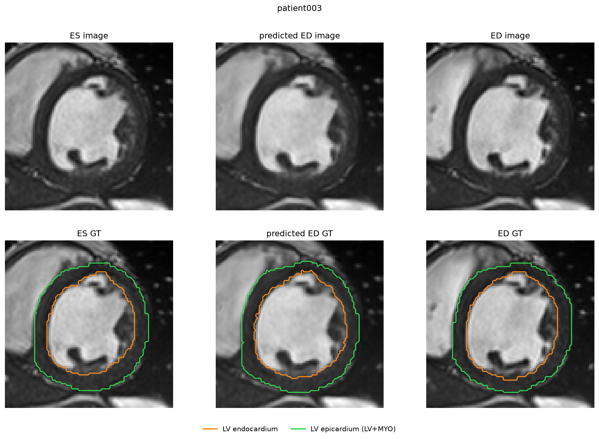
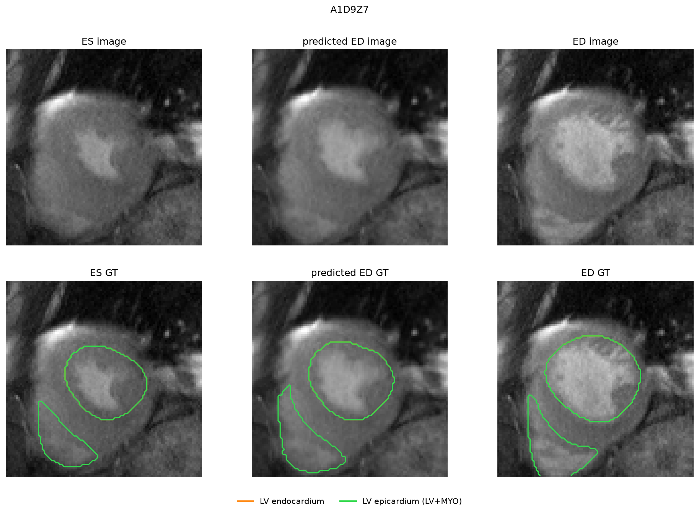
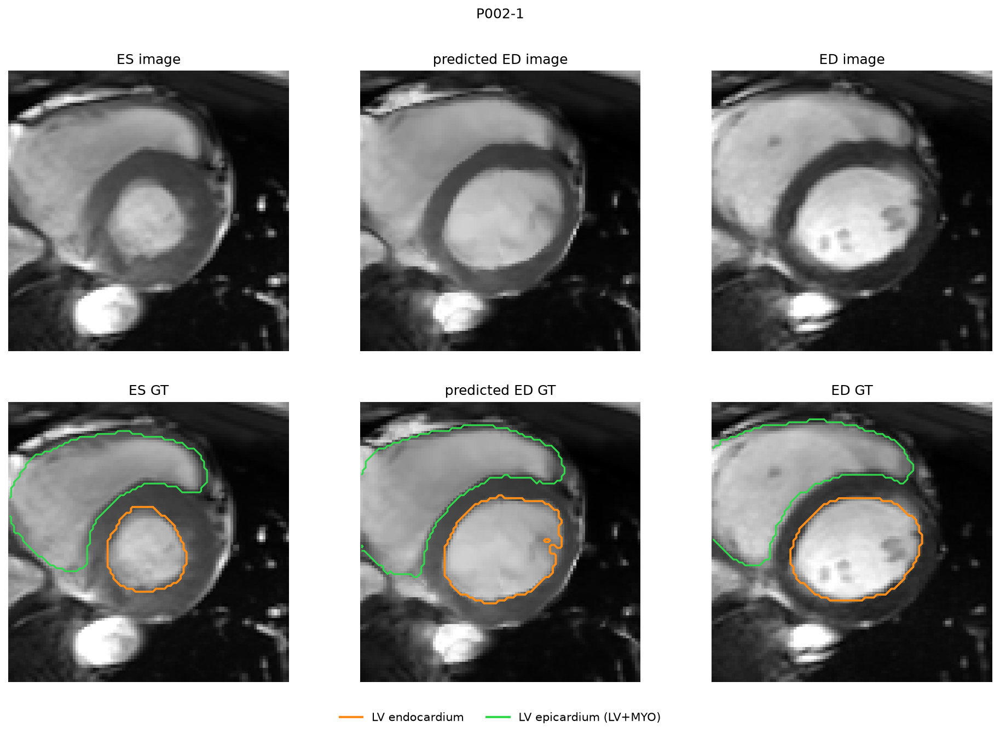

# Cardiac Deformable Image Registration

Deformable image registration estimates a dense spatial mapping between two images of the same anatomy. In cardiac MRI, this mapping describes how the heart muscle moves between end-diastole (ED) and end-systole (ES), and supports automatic motion analysis that would otherwise require manual delineation.

DIR-MRVIT uses a **Laplacian pyramid** with **Convolutional Projection Transformer Blocks (CPTBs)** trained in a **coarse-to-fine** manner to register cardiac MR images between end-diastole and end-systole.

The original paper evaluates DIR-MRVIT on ACDC17, M&Ms20, and CMRxM22, but the released code base only covers M&Ms20. This project adds the missing pieces: a stratified 5-fold cross-validation pipeline for ACDC17, a preprocessing and evaluation pipeline for CMRxM22, and per-dataset results scripts that run the trained models on sample patients and report the metrics. The original model code (`GP_TF.py`, `TransBlock.py`, `Functions.py`) is used as published; everything else in `Code/` was written here.

Reference paper: Lu et al., *Deformable image registration using multi-resolution vision Transformer for cardiac motion estimation*, Phys. Med. Biol. 71, 025004 (2026). [DOI](https://doi.org/10.1088/1361-6560/ae365a). Original repository: https://github.com/xslu-scuec/DIR-MRVIT.

---

## Repository structure

```
cardiac_deformable_registration/
│
├── Code/
│   ├── GP_TF.py                    # 3-level Laplacian pyramid model (original, unchanged)
│   ├── TransBlock.py               # Convolutional Projection Transformer Block (original)
│   ├── Functions.py                # Grid generation, dataset utilities (original)
│   ├── Train_GPTF_disp.py          # Original training script (reference)
│   ├── Test_GPTF_disp.py           # Original test script (reference)
│   │
│   ├── cross_validation_acdc.py    # ACDC17 5-fold stratified cross-validation
│   ├── cross_validation_mms.py     # M&Ms20 5-fold cross-validation
│   │
│   ├── preprocess_mms.py           # M&Ms20 preprocessing
│   ├── preprocess_cmrxm22.py       # CMRxM22 preprocessing 
│   │
│   ├── acdc_results.py             # ACDC17 metrics + qualitative figure (sample data)
│   ├── mms_results.py              # M&Ms20 metrics + qualitative figure (sample data)
│   └── cmr_results.py              # CMRxM22 metrics + qualitative figure (sample data)
│
├── Data/
│   ├── sample_data/                # Sample patients shipped with the repo for the demo
│   │   ├── acdc/                   # 10 ACDC patients (raw NIfTI)
│   │   ├── mms/                    # 10 M&Ms patients (preprocessed)
│   │   └── cmrxm22/                # 18 CMRxM22 scans (preprocessed)
│   └── 211230_M&Ms_Dataset_information_diagnosis_opendataset.csv
│
├── Models_cv_full/                 # ACDC17 trained checkpoints (5 folds)
├── Models_mms_full/                # M&Ms20 trained checkpoints (5 folds)
│
├── Results/
│   └── cmrxm22/                    # Per-case CMRxM22 evaluation results
│
├── Figures/                        # Example qualitative figures (one per dataset)
│
├── README.md
├── requirements.txt
└── .gitignore
```

---

## Hardware requirements

- GPU with CUDA support recommended (tested on NVIDIA RTX 5070 Ti, CUDA 12.8)
- Minimum 8 GB VRAM for training
- The results scripts also run on CPU, only slower
- Python 3.12

For CUDA versions other than 12.8, see https://pytorch.org/get-started/locally/ for the matching `torch` install command, then continue with `pip install -r requirements.txt`.

---

## Getting started

The repository ships with a small set of sample patients so that the trained models can be tried out **without downloading any of the full datasets**.

The commands below clone the repository, install PyTorch and the remaining dependencies, and run the three results scripts. They can be copied and pasted into a terminal as a single block.

**GPU (CUDA 12.8)**

```bash
git clone https://github.com/ecemkaraoglu/cardiac_deformable_registration.git
cd cardiac_deformable_registration
pip install torch==2.11.0+cu128 torchvision==0.26.0+cu128 --index-url https://download.pytorch.org/whl/cu128
pip install -r requirements.txt
python Code/acdc_results.py
python Code/mms_results.py
python Code/cmr_results.py
```

**CPU only**

```bash
git clone https://github.com/ecemkaraoglu/cardiac_deformable_registration.git
cd cardiac_deformable_registration
pip install torch==2.11.0 torchvision==0.26.0
pip install -r requirements.txt
python Code/acdc_results.py
python Code/mms_results.py
python Code/cmr_results.py
```

Each results script runs the trained models on its sample patients and prints a per-patient table followed by a sample / full / paper comparison. It then opens a matplotlib window with one random patient: the ES, predicted ED, and ED images on top, and the matching contours (LV endocardium and epicardium) below.

### Useful options

Each script takes the same options:

```bash
python Code/acdc_results.py --patient patient003 --slice 6   # pick a specific patient and slice
python Code/mms_results.py  --subject A1D9Z7                  # M&Ms uses --subject
python Code/cmr_results.py  --case P002-1                     # CMRxM22 uses --case
python Code/acdc_results.py --no-show                         # print metrics only, no figure
python Code/acdc_results.py --save Figures/acdc_example.png   # save the figure instead of showing it
```

For CMRxM22 the model is the M&Ms-trained one. By default all five fold models are applied and averaged; `--fold 0` uses a single fold instead.

---

## Datasets

Only required to reproduce the full training and evaluation. The sample data is included, so the results scripts need no external download.

### ACDC17

- Download: https://www.creatis.insa-lyon.fr/Challenge/acdc/databases.html
- Place patient folders in `Data/training/`, e.g. `Data/training/patient001/`.

### M&Ms20

- Download: https://www.ub.edu/mnms/
- Place raw cases in `Data/MMs_training/`.
- The diagnosis CSV is already included at `Data/211230_M&Ms_Dataset_information_diagnosis_opendataset.csv`.

### CMRxM22

- Download: https://zenodo.org/records/6362258
- Place the extracted folder at `Data/CMRxM22_raw/`.

---

## Preprocessing

ACDC17 preprocessing (resample to 1.25 x 1.25 x 5.0 mm, crop to 96 x 96 x 16, intensity normalization) is performed inline by the ACDC scripts (`cross_validation_acdc.py` and `acdc_results.py`). No separate `preprocess_acdc.py` step is needed.

M&Ms20 and CMRxM22 use disk-based preprocessing because of their heavier transformations (4D timeseries extraction, IQA filtering, label remapping). All three datasets apply the same operations conceptually (resample, crop, normalize); only the location of the code differs.

### M&Ms20

```bash
python Code/preprocess_mms.py
```

Extracts ED and ES frames from the 4D series, resamples to 1.25 x 1.25 x 8 mm, applies anchored cropping (ED-based crop box reused for ES), and writes preprocessed NIfTI files to `Data/MMs_preprocessed/`.

### CMRxM22

```bash
python Code/preprocess_cmrxm22.py --raw_dir Data/CMRxM22_raw --out_dir Data/CMRxM22_preprocessed
```

Filters out non-diagnostic cases via the IQA score, resamples, crops, remaps labels into the M&Ms20 convention, and writes a `pairs.txt` file used by the evaluation script.

---

## Training

Pre-trained checkpoints for all folds are already included in `Models_cv_full/` (ACDC17) and `Models_mms_full/` (M&Ms20). The commands below only need to be re-run to reproduce training from scratch.

### ACDC17

```bash
python Code/cross_validation_acdc.py
```

Stratified 5-fold split, 4 patients per pathology group in each test fold. Checkpoints are saved as `Models_cv_full/fold{i}_lvl3_best.pth`.

### M&Ms20

```bash
python Code/cross_validation_mms.py
```

5-fold split with 105 train / 15 validation / 30 test patients per fold. Checkpoints are saved as `Models_mms_full/fold{i}_lvl3_best.pth`.

---

## Results

Each results script prints three columns. The **sample** column is the metric on the small sample subset shipped with this repository (10 ACDC, 10 M&Ms, 18 CMRxM22); ACDC and M&Ms evaluate each patient with the fold model whose test set it belongs to, and CMRxM22 averages all five M&Ms-trained folds. The **full** column is the full-dataset result reproduced in this project: 5-fold stratified cross-validation on the 100 ACDC17 patients, 5-fold cross-validation on the 150 M&Ms20 patients (with smoothness weight lambda=0.2), and zero-shot transfer to the CMRxM22 cases averaged across the five M&Ms-trained fold models. The **paper** column is from Tables 2-4 of the original paper. HD is reported as HD95.

### ACDC17

| Metric          | Sample (10)      | Full (100)       | Paper            |
|-----------------|------------------|------------------|------------------|
| LV Dice         | 0.865 ± 0.084    | 0.887 ± 0.069    | 0.917 ± 0.043    |
| MYO Dice        | 0.756 ± 0.062    | 0.752 ± 0.065    | 0.789 ± 0.055    |
| Endo ASSD (mm)  | 2.018 ± 1.234    | 1.509 ± 1.033    | 0.790 ± 0.390    |
| Epi ASSD (mm)   | 1.578 ± 0.668    | 1.082 ± 0.512    | 0.880 ± 0.210    |
| Endo HD (mm)    | 6.191 ± 2.995    | 5.270 ± 2.428    | 5.620 ± 1.220    |
| Epi HD (mm)     | 5.699 ± 2.442    | 4.399 ± 2.012    | 5.510 ± 1.770    |
| Jacobian (%)    | 0.142 ± 0.171    | 0.129 ± 0.163    | 0.409 ± 0.153    |



### M&Ms20

| Metric          | Sample (10)      | Full (150)       | Paper            |
|-----------------|------------------|------------------|------------------|
| LV Dice         | 0.891 ± 0.026    | 0.877 ± 0.050    | 0.884 ± 0.038    |
| MYO Dice        | 0.780 ± 0.054    | 0.790 ± 0.070    | 0.729 ± 0.057    |
| Endo ASSD (mm)  | 1.287 ± 0.302    | 1.620 ± 0.923    | 1.880 ± 0.790    |
| Epi ASSD (mm)   | 1.933 ± 0.488    | 2.081 ± 0.736    | 2.050 ± 0.830    |
| Endo HD (mm)    | 6.859 ± 1.412    | 7.153 ± 2.769    | 7.400 ± 2.780    |
| Epi HD (mm)     | 8.132 ± 0.837    | 8.744 ± 2.277    | 8.160 ± 1.950    |
| Jacobian (%)    | 0.243 ± 0.145    | 0.275 ± 0.195    | 0.536 ± 0.321    |



### CMRxM22 (zero-shot)

| Metric          | Sample (18)      | Full             | Paper            |
|-----------------|------------------|------------------|------------------|
| LV Dice         | 0.871 ± 0.035    | 0.854 ± 0.067    | 0.892 ± 0.027    |
| MYO Dice        | 0.825 ± 0.031    | 0.756 ± 0.085    | 0.703 ± 0.050    |
| Endo ASSD (mm)  | 1.860 ± 0.719    | 1.944 ± 0.863    | 1.780 ± 0.600    |
| Epi ASSD (mm)   | 2.121 ± 0.604    | 2.629 ± 0.824    | 1.940 ± 0.690    |
| Endo HD (mm)    | 7.187 ± 1.984    | 7.498 ± 2.123    | 7.820 ± 2.310    |
| Epi HD (mm)     | 7.792 ± 1.064    | 9.393 ± 2.649    | 8.070 ± 2.240    |
| Jacobian (%)    | 0.903 ± 0.438    | 1.046 ± 0.505    | 0.303 ± 0.141    |



The ablation comparing smoothness weights (lambda=0.5 vs lambda=0.2 on M&Ms20) and per-fold breakdowns are reported in the project report.

---

## Citation

If you use this code, please cite the original paper:

```bibtex
@article{lu2026dir,
  title={Deformable image registration using multi-resolution vision Transformer for cardiac motion estimation},
  author={Lu, Xuesong and Zhao, Huaqiu and Chen, Hong and Yang, Dandan and Zhang, Su and Xie, Qinlan},
  journal={Physics in Medicine \& Biology},
  volume={71},
  pages={025004},
  year={2026},
  publisher={IOP Publishing}
}
```

---

## Acknowledgements

This project was carried out for the EE634 Digital Image Processing course at Middle East Technical University. The DIR-MRVIT model code is the work of Lu et al.; this repository contains the multi-dataset extensions and evaluation pipeline built around it.